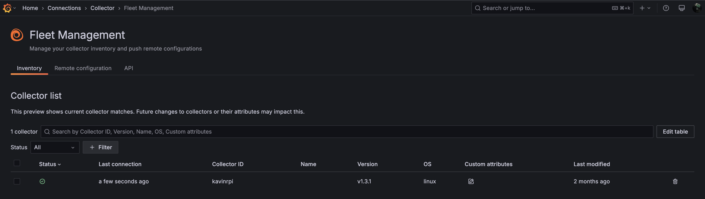
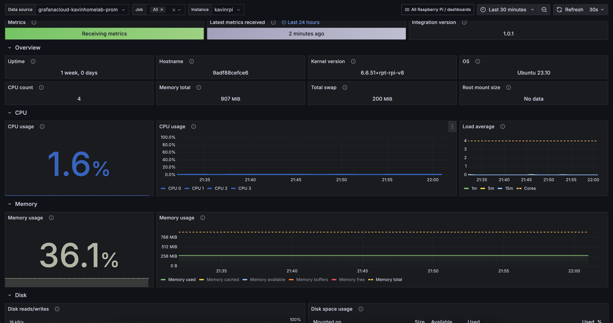
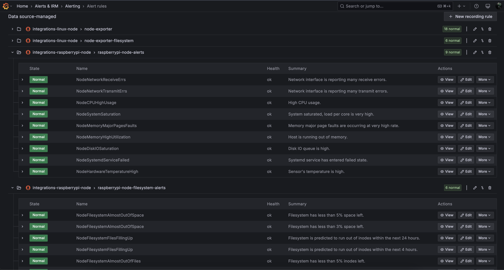
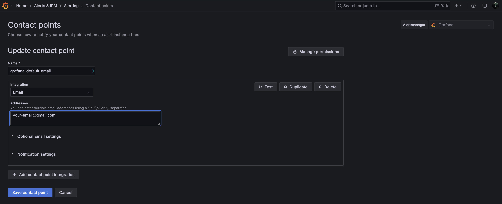

# Monitoring RPi using Grafana Cloud & Alloy

## Problem
I have an old [Raspberry PI 3](https://www.raspberrypi.com/products/raspberry-pi-3-model-b-plus/) that I used during my college days for applications like drones and robotics. Recently, I decided to repurpose it to run a simple [Pi-hole](https://www.raspberrypi.com/tutorials/running-pi-hole-on-a-raspberry-pi/) setup to block ads across my home network and devices. One day, my RPi unexpectedly froze, and I had no idea that my DNS requests were failing until I noticed connectivity issues. A reboot resolved the problem, but it made me realize the need for proactive monitoring. Since my router is configured to use Pi-hole as both the primary and secondary DNS (yes, I know I should have a better failover strategy but for now, it works fine), a failure like this can disrupt my entire network.
<!-- more -->

This got me thinking — why not monitor my Raspberry Pi to catch these issues before they cause problems? Given that it's still a critical piece of hardware in my setup, I need a reliable and highly available monitoring solution. However, I don’t want to self-host my monitoring services; I prefer a managed, cloud-hosted solution that I can trust. Well, I might change this thought in future. More on that later :)

## Why Grafana Cloud & Alloy?
**[Grafana Cloud](https://grafana.com/pricing/):** I had very good experience with Grafana, Prometheus and its stack in my work, so I thought why not give a try with their Grafana Cloud variant. And then came to know it
offers really good free-tier experience which fits for my use-case.

What comes with Cloud free?
> Metrics **10k** metrics billable series; Logs, Traces, Profiles **50 GB** each all with **14 days** retention

This is more than enough to monitor my devices.

**[Grafana Alloy](https://grafana.com/docs/alloy/latest/):** It is a flexible, high-performance, vendor-neutral distribution of the OpenTelemetry Collector which is an alternative for the Grafana agent. It’s fully compatible with popular open-source observability standards like OpenTelemetry and Prometheus. This was my first time using Alloy and I must say, the setup was straightforward and hassle-free.

In my setup, Alloy runs as an agent on my Raspberry Pi, collecting and forwarding metrics to Grafana Cloud.

## Setup Raspberry Pi Integration
For the actual integration in Grafana Cloud, please follow the official [documentation](https://grafana.com/docs/grafana-cloud/monitor-infrastructure/integrations/integration-reference/integration-raspberry-pi-node/#raspberry-pi-integration-for-grafana-cloud).

***tldr:***

1. In your Grafana Cloud stack, click `Connections` in the left-hand menu.
2. Find `Raspberry Pi` and click its tile to open the integration.
3. Review the prerequisites in the `Configuration Details` tab and set up Grafana Agent to send Raspberry Pi metrics and logs to your Grafana Cloud instance. (**Note:** Check next section on the detailed setup.)
4. Click `Install` to add this integration’s pre-built dashboards and alerts to your Grafana Cloud instance, and you can start monitoring your Raspberry Pi setup.

## Setup Alloy in Docker
I've installed Docker on my Raspberry Pi, which runs the Alloy agent along with a few other services. I created a Dockerfile that copies all the necessary configurations for Alloy and pushes the image to my private GitHub Registry.

(Goodbye, Docker Hub! I'm tired of dealing with rate limits on the free tier...)

### Configuring Alloy
Pull the required alloy config from the [Raspberry PI integration](https://grafana.com/docs/grafana-cloud/monitor-infrastructure/integrations/integration-reference/integration-raspberry-pi-node/#install-raspberry-pi-integration-for-grafana-cloud) in Grafana Cloud. For example, here is my config:
```hcl title="config.alloy"
remotecfg {
    url            = "https://<YOUR_GRAFANA_REMOTE_FLEET_ENDPOINT>"
    id             = "kavinrpi"
    poll_frequency = "60s"

    basic_auth {
        username = ""*******"
        password = "*******"
    }
}

prometheus.exporter.unix "integrations_node_exporter" { }

discovery.relabel "integrations_node_exporter" {
    targets = prometheus.exporter.unix.integrations_node_exporter.targets

    rule {
        target_label = "instance"
        replacement  = "kavinrpi"
    }

    rule {
        target_label = "job"
        replacement  = "integrations/raspberrypi-node"
    }
}

prometheus.scrape "integrations_node_exporter" {
    targets    = discovery.relabel.integrations_node_exporter.output
    forward_to = [prometheus.relabel.integrations_node_exporter.receiver]
    job_name   = "integrations/node_exporter"
}

// Very minimal metrics which I export, you could add others as well
prometheus.relabel "integrations_node_exporter" {
    forward_to = [prometheus.remote_write.metrics_service.receiver]

    rule {
        source_labels = ["__name__"]
        regex         = "up|node_boot_time_seconds|node_cpu_seconds_total|node_disk_io_time_seconds_total|node_disk_io_time_weighted_seconds_total|node_disk_read_bytes_total|node_disk_written_bytes_total|node_filesystem_avail_bytes|node_filesystem_files|node_filesystem_files_free|node_filesystem_readonly|node_filesystem_size_bytes|node_hwmon_temp_celsius|node_load1|node_load15|node_load5|node_memory_Buffers_bytes|node_memory_Cached_bytes|node_memory_MemAvailable_bytes|node_memory_MemFree_bytes|node_memory_MemTotal_bytes|node_memory_Slab_bytes|node_memory_SwapTotal_bytes|node_network_receive_bytes_total|node_network_receive_drop_total|node_network_receive_errs_total|node_network_receive_packets_total|node_network_transmit_bytes_total|node_network_transmit_drop_total|node_network_transmit_errs_total|node_network_transmit_packets_total|node_os_info|node_systemd_unit_state|node_uname_info|node_vmstat_pgmajfault"
        action        = "keep"
    }
}

// Write metrics to your Grafana Cloud Prometheus instance
prometheus.remote_write "metrics_service" {
    endpoint {
        url = "https://<YOUR_PROMETHEUS_ENDPOINT>/api/prom/push"

        basic_auth {
            username = "*******"
            password = "*******"
        }
    }
}
```

All the above endpoints will be available once you complete the steps in the Raspberry Pi integration window in Grafana Cloud.

To enable log collection, append the following configuration to your `config.alloy`
```hcl
discovery.relabel "logs_integrations_integrations_node_exporter_journal_scrape" {
	targets = []

	rule {
		source_labels = ["__journal__systemd_unit"]
		target_label  = "unit"
	}

	rule {
		source_labels = ["__journal__boot_id"]
		target_label  = "boot_id"
	}

	rule {
		source_labels = ["__journal__transport"]
		target_label  = "transport"
	}

	rule {
		source_labels = ["__journal_priority_keyword"]
		target_label  = "level"
	}
}

loki.source.journal "logs_integrations_integrations_node_exporter_journal_scrape" {
	max_age       = "24h0m0s"
	relabel_rules = discovery.relabel.logs_integrations_integrations_node_exporter_journal_scrape.rules
	forward_to    = [loki.write.grafana_cloud_loki.receiver]
	labels        = {
		instance = constants.hostname,
		job      = "integrations/raspberrypi-node",
	}
}

local.file_match "logs_integrations_integrations_node_exporter_direct_scrape" {
	path_targets = [{
		__address__ = "localhost",
		__path__    = "/var/log/{syslog,messages,*.log}",
		instance    = constants.hostname,
		job         = "integrations/raspberrypi-node",
	}]
}

loki.source.file "logs_integrations_integrations_node_exporter_direct_scrape" {
	targets    = local.file_match.logs_integrations_integrations_node_exporter_direct_scrape.targets
	forward_to = [loki.write.grafana_cloud_loki.receiver]
}
```

### Creating Dockerfile
```Dockerfile title="Dockerfile"
FROM grafana/alloy:v1.3.1

# Copy the custom config file into the image
COPY ./configs/rpi-config.alloy /etc/alloy/config.alloy

CMD ["run", "--server.http.listen-addr=0.0.0.0:12345", "--stability.level=public-preview", "/etc/alloy/config.alloy"]
```

Now, you can build and push the images to your registry. For example, I use [Podman](https://podman.io/docs/installation) as my container management tool
```bash title="Build & Push Images"
## Build & Push using podman with multi-arch images
podman manifest create rpi-alloy
podman build -f rpi.Dockerfile --platform linux/amd64,linux/arm64 -t <REGISTRY>/<USERNAME>/alloy:rpi-0.1.0 --manifest localhost/rpi-alloy
podman manifest push localhost/rpi-alloy <REGISTRY>/<USERNAME>/alloy:rpi-0.1.0
```

### Fleet Management
Once the agent is up and running on your Raspberry Pi, it will appear in the fleet management dashboard, as shown below. You can add multiple agents depending on your setup and monitoring needs.



## Dashboards & Alerting
By default, when you set up the integration, Grafana automatically installs dashboards for both logs and metrics. Alert recording rules comes by default as well for these dashboards, you can cusomtize the alerting as you wish. Here’s how they look:

**Dashboard:**



**Alert Rules:**



Under **Alerts & IRM -> Alerting -> Contact Points** add your default email contact for notifications.



## Final points
Monitoring my Raspberry Pi with Grafana Alloy and Grafana Cloud proved to be an easy and effective solution. Alloy collects system metrics and logs, while Grafana Cloud provides a reliable, hassle-free observability platform. With this setup, I have real-time insights into my Pi. In the future, I may explore Loki for enhanced logging and setup monitoring PiHole as well. How do you monitor your homelab? 🚀
