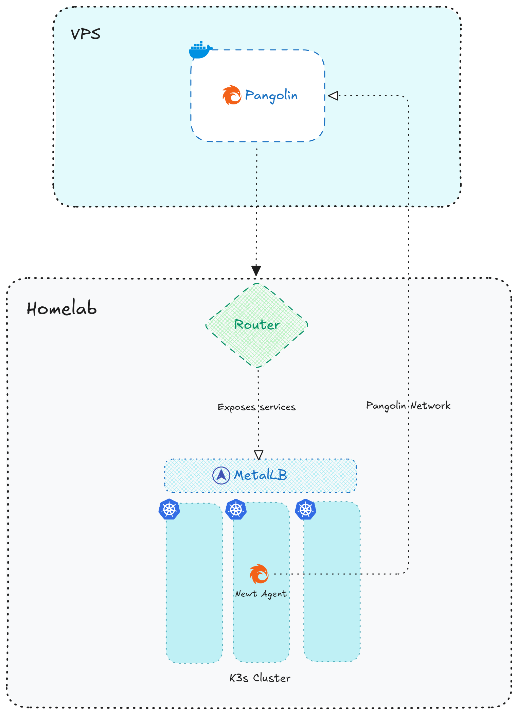

# Self-Hosting Pangolin: My Simple Setup for Accessing Homelab

## Problem
Anyone who self-hosts eventually hits the same problem - how do you expose services to the internet securely without complicating your entire setup? Sure, you can buy a static IP and forward ports, but that comes with cost, security risks, and the chance of exposing your whole network. I wanted none of that. I didn’t want to:

  - Open random ports on my router
  - Maintain reverse proxy configs
  - Expose my entire Kubernetes cluster
  - Deal with VPN or DNS hassles

So I started looking for a simpler, safer way.

## What is Pangolin?
[Pangolin](https://github.com/fosrl/pangolin) is a lightweight, self-hosted reverse proxy tunnel that lets you securely expose services running in your private network—without opening ports or relying on third-party tunnels.

Think of it as your own self-hosted alternative to tools like [Cloudflare Tunnel](https://developers.cloudflare.com/cloudflare-one/networks/connectors/cloudflare-tunnel/) or [FRP](https://github.com/fatedier/frp), but much simpler to deploy and easier to manage. Pangolin runs two components:

- **Pangolin Server** (public-facing): Runs on your VPS or any machine with a public IP.
    - Pangolin itself - Dashboard, Authentication etc.,
    - Gerbil - Wireguard interface
    - Traefik - Reverse proxy
- **Pangolin Agent** (private): Runs in your homelab and connects out to the server.

Once connected, Pangolin securely routes incoming traffic from the VPS to your internal services, without exposing your LAN or Kubernetes cluster directly.

## My Homelab Architecture (High-Level)
Below is a high-level overview of how my Pangolin setup integrates with my homelab Kubernetes network and how the services are exposed externally. I’ll save the deep-dive architecture and technical internals for a separate blog, but this overview should give you a clear picture of the setup for now.



## Setting Up Pangolin

### Prerequesites

From the [docs](https://docs.pangolin.net/self-host/quick-install#prerequisites):

  1. Linux server with root access and public IP address
  2. Domain name pointing to your server’s IP address for the dashboard
  3. Email address for Let’s Encrypt SSL certificates and admin log in
  4. Open ports on firewall for 80 (TCP), 443 (TCP), 51820 (UDP), and 21820 (UDP for clients)

### Pangolin Server – runs on my VPS
This is the only public-facing part of the setup. I don't want to explain every detail of deloying the server itself, I deployed it on my VPS using Docker Compose as mentioned in docs [here](https://docs.pangolin.net/self-host/manual/docker-compose), and it listens for incoming traffic from the internet. All site, resources routing rules and service mappings are configured in Pangolin Dashboard once deployed.

Respective `config.yml` for the server.
```yaml
## config.yml
app:
  dashboard_url: "https://pangolin.example.com"

domains:
  domain1:
    base_domain: "pangolin.example.com"
    cert_resolver: "letsencrypt"

server:
  # Note: This should be saved for the newt agent for comm's
  secret: "your-strong-secret"

gerbil:
  base_endpoint: "pangolin.example.com"

flags:
  require_email_verification: true
  disable_signup_without_invite: true
  disable_user_create_org: true
```

### Newt Agent – K8s deployment

Pangolin Tunnel can be installed in 3 ways:

1. **Newt Tunnel** - Recommended way for tunnel creation.
2. **Basic Wireguard** - Complicated way, needs WireGuard client and NAT setup.
3. **Local** - no tunneling, just want to run locally using Pangolin features.

In this setup, I had proceeded with *Newt tunnel* mode for agent communication.

- Since my entire setup follows a GitOps workflow, I use [Sealed Secrets](https://github.com/bitnami-labs/sealed-secrets) to securely manage and deploy the Pangolin credentials.
**Note:** The `NEWT_ID` and `NEWT_SECRET` can fetched once you create your site from the Pangolin Dashboard.
```yaml
## Create .env file with secrets
NEWT_ID=**************
PANGOLIN_ENDPOINT=https://pangolin.example.com
NEWT_SECRET=**************

## Create Envs for newt
kubectl create secret generic newt-cred -n pangolin --from-env-file=newt-cred.env --dry-run=client -o yaml > newt-secret.yaml

## Seal using kubeseal
kubeseal --format yaml --controller-namespace kubeseal --controller-name kubeseal-sealed-secrets < newt-secret.yaml > ./credentials.yaml

## credentials.yaml
apiVersion: bitnami.com/v1alpha1
kind: SealedSecret
metadata:
name: newt-cred
namespace: pangolin
spec:
encryptedData:
    NEWT_ID: *************************
    NEWT_SECRET: *************************
    PANGOLIN_ENDPOINT: *************************
template:
    metadata:
    name: newt-cred
    namespace: pangolin
```
- Newt instances are deployed using the official helm chart
```yaml
## Newt install
helm repo add fossorial https://charts.fossorial.io
helm repo update fossorial

helm install pangolin-newt fossorial/newt -f values.yaml

## values.yaml
newtInstances:
  - name: my-homelab
    enabled: true
    service:
      annotations:
        metallb.io/loadBalancerIPs: 192.168.0.111
    auth:
      existingSecretName: newt-cred
      keys:
        endpointKey: PANGOLIN_ENDPOINT
        idKey: NEWT_ID
        secretKey: NEWT_SECRET
```

## Exposing services
Once both the Pangolin Server and Agent were running, exposing my Kubernetes services became straightforward. Instead of creating Ingress rules, configuring LoadBalancers, or dealing with port mappings, all I had to do was define how each service should be routed through Pangolin.

### Creating Sites
This would be the first step when you onboard the newt agent in your home network.

1. **Create a new Site** in the Pangolin dashboard and give it any meaningful name.
2. **Assign an address** to the Site from your organization’s subnet - in most cases, the default value works perfectly fine.
3. A Site contains **resources**, and these resources automatically form encrypted WireGuard tunnels, all without opening ports or exposing any internal services.


### Mapping Resources
Resources allow you to define the destination endpoints for your services and even distribute traffic across multiple backends for load balancing.

- You can configure all the **Layer-7** features you’d expect, including path-based routing, rewrite rules, and more.
- Make sure to map a verified domain from your **domain** list.
- One thing to keep in mind about domains: if you want to use a subdomain under the base endpoint you specified during installation, you may need to create an additional `A` record in your DNS provider that points to your VPS. This is only necessary if your root domain isn’t already mapped to the VPS.
- For example: my root domain is used for hosting a public site, but `auth.example.com` (which points to my VPS via an `A` record) is dedicated for the Pangolin dashboard. Now I'll be creating individual subdomains in Pangolin and mark them as verified by creating an `A` record to the VPS.
- In the **target** configuration, we route the traffic to the internal `svc.cluster.local` DNS or the metal LB IP that you provisioned for the services.
- Enable Pangolin SSO **Authentication** if needed and now you're good to go!


## Wrapping up
Setting up Pangolin for my homelab turned out to be one of the simplest and cleanest ways to securely expose my services to the internet without touching router configs, opening ports, or relying on third-party SaaS tunnels (even Pangolin has a cloud version). With a lightweight server on my VPS and an agent running inside my cluster, everything stays private while still being accessible from anywhere.

If you're tinkering with homelabs or looking for a self-hosted tunnel alternative, [Pangolin](https://docs.pangolin.net) is definitely worth exploring!