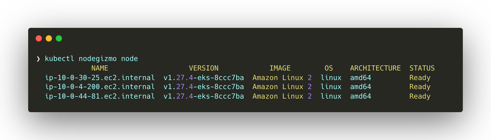
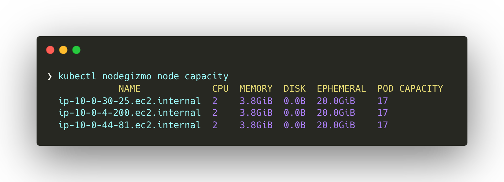
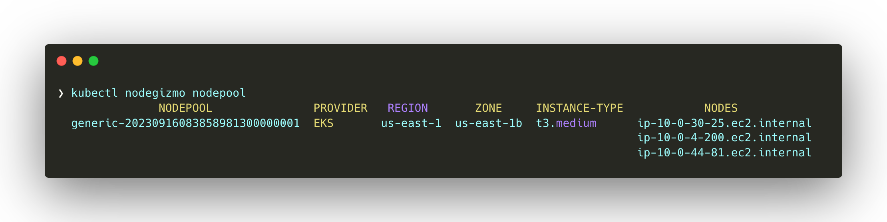

A small command-line utility for your Kubernetes nodes.

## Installation
`nodegizmo` kubectl plugin is available in [krew](https://krew.sigs.k8s.io/) plugin manager. Anyone can install with the following steps:

- Install `krew` for kuebctl using the following [doc](https://krew.sigs.k8s.io/docs/user-guide/setup/install/).
- Run `kubectl krew install nodegizmo`

## Features
### nodegizmo node
This command displays the generic node related information. For example:

  - NodeName
  - K8sVersion
  - Image
  - OS & Architecture info
  - NodeStatus (Ready/NotReady)
  - Taints
  - Node Provider (AWS/Azure/GCP)
  - Topology info (Region & Zone)

### nodegizmo node capacity
Node Capacity information

  - CPU
  - Memory
  - Disk
  - Ephemeral storage
  - Pod capacities
  - Nodepool related information

### nodegizmo nodepool
Nodepool related information

  - Grouped by NodePool ID
  - Node list
  - Topology info (Region & Zone)
  - Instance type
  - K8sVersion
  - Nodepool provider (supported: EKS/AKS/GKE/Karpenter)

### nodegizmo exec nodeName
Exec into any node by spawning a `nsenter` pod automatically based on the node selection.